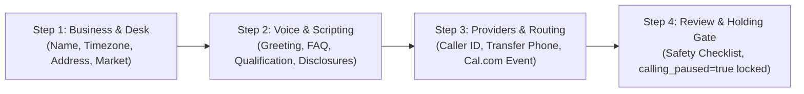

# Phase 4 — Customer Onboarding UI & Architecture Audit

> **Audit Type:** Read-Only Technical Architecture & UI Flow Audit  
> **Repository Commit Baseline:** `31cd2c0f6fdf391d17d0b3c6aaedbcffbebbffbe`  
> **Production Safety State:** `LEADSPRINT_KILL_SWITCH=true` | `calling_paused=true` (Outbound Calling Disabled)  
> **Real Customer #1 Status:** `NOT YET ONBOARDED`  
> **Reference Standards:** [docs/PHASE4_REAL_CUSTOMER_ONBOARDING_FORM.md](file:///c:/Users/Swetha/Downloads/LeadSprint-Boomi-main/LeadSprint-Boomi-main/docs/PHASE4_REAL_CUSTOMER_ONBOARDING_FORM.md), [docs/PHASE4_REAL_CUSTOMER1_INTAKE_CHECKLIST.md](file:///c:/Users/Swetha/Downloads/LeadSprint-Boomi-main/LeadSprint-Boomi-main/docs/PHASE4_REAL_CUSTOMER1_INTAKE_CHECKLIST.md)

---

## 1. Existing Frontend Architecture

### Technology Stack & Routing
- **Framework:** React 19 + TypeScript + Vite (`artifacts/leadsprint`).
- **Routing Engine:** `wouter` (declarative client-side routing with `basePath` support).
- **State & Data Fetching:** TanStack React Query (`@tanstack/react-query`) with auto-generated typed hooks from `@workspace/api-client-react` (via Orval from `lib/api-spec/openapi.yaml`).
- **Authentication:** Dual-mode authentication architecture:
  - **Production:** Clerk Authentication (`@clerk/react` with custom styled components).
  - **Development/Demo:** Local demo auth toggle gated behind `VITE_LEADSPRINT_DEMO_AUTH` (strictly disabled in production).
- **Styling & Tokens:** Tailwind CSS v4 with custom HSL CSS variables, DM Sans typography, dark slate accents (`#183746`), and warm cream backgrounds (`#fbfaf5`).

### Current Route Hierarchy in `App.tsx`:
```text
/ (HomeRoute -> LandingPage)
/sign-in/*? (SignInPage -> ClerkSignInPage / DemoSignInPage)
/sign-up/*? (SignUpPage -> ClerkSignUpPage / DemoSignUpPage)
/workspace (AuthGate -> Shell Layout)
  ├── /workspace (TodayPage - Operator Desk & Alerts)
  ├── /workspace/leads (LeadsPage - Lead Pipeline & Detail Slide-over)
  ├── /workspace/calls (CallsPage - Voice Desk & Call Detail Slide-over)
  ├── /workspace/appointments (AppointmentsPage - Showing Schedule)
  ├── /workspace/reports (ReportsPage - Weekly Pulse & Usage Entitlement)
  └── /workspace/business-settings (SettingsPage - Policy Controls & Desk Config)
```

---

## 2. Existing Customer / Business Settings UI

The existing `SettingsPage` component (`artifacts/leadsprint/src/App.tsx` lines 467–478) provides a single unified form with three distinct sections:

1. **Business Context Section:**
   - `Business name` (Read-only input)
   - `Project / desk name` (Editable text field)
   - `Market` (Select dropdown: `US` / `IN`)
   - `Timezone` (Editable text field)
   - `Transfer number` (Editable E.164 phone field)
   - `Quiet hours` (Editable time window string)
   - `Recording disclosure` & `AI disclosure` (Interactive toggle buttons)
2. **Policy Controls Section:**
   - `Maximum call attempts` (Number input, 1–10)
   - `Emergency Calling Pause` (Prominent Action button: "Pause Dialing" / "Resume Dialing" with state display)
   - `Connected services` (Read-only badges showing connection status for `retellAgentId` and `calEventTypeId`)
3. **Approved Language Section:**
   - `Approved FAQ` (Multiline textarea)
   - `Qualification questions` (Multiline textarea, parsed as line-delimited array)
   - `Escalation rules` (Read-only textarea)

---

## 3. Existing Backend APIs

The backend API server (`artifacts/api-server/src/routes/leadsprint.ts`) exposes the following endpoints relevant to customer configuration:

| Endpoint | Method | Operation ID | Functionality & Payload |
| :--- | :---: | :--- | :--- |
| `/api/auth/me` | `GET` | `getAuthMe` | Resolves authenticated Clerk operator session, returning `user` and `business` tenant models. |
| `/api/business-settings` | `GET` | `getBusinessSettings` | Retrieves all configured settings for the authenticated tenant. |
| `/api/business-settings` | `PATCH` | `updateBusinessSettings` | Updates tenant configuration fields (`market`, `timezone`, `transfer_number`, `project_name`, `approved_faq`, `qualification_questions`, `recording_disclosure`, `ai_disclosure`, `quiet_hours`, `max_call_attempts`, `calling_paused`). |
| `/api/today` | `GET` | `getToday` | Returns today metrics, unresolved messages count, upcoming showings, and activity feed. |
| `/api/usage` | `GET` | `getUsage` | Returns voice minutes consumed vs `included_minutes` (300m) and estimated provider costs. |

---

## 4. Existing Persistence Model

The PostgreSQL schema (`lib/db/src/schema/leadsprint.ts`) models business tenant configuration in `businessesTable`:

```typescript
export const businessesTable = pgTable("businesses", {
  id: text("id").primaryKey(),
  name: text("name").notNull(),
  market: text("market").notNull().default("US"),
  timezone: text("timezone").notNull().default("America/New_York"),
  phoneNumber: text("phone_number").notNull(),
  transferNumber: text("transfer_number").notNull(),
  recordingDisclosure: boolean("recording_disclosure").notNull().default(true),
  aiDisclosure: boolean("ai_disclosure").notNull().default(true),
  quietHours: text("quiet_hours").notNull().default("21:00–08:00"),
  maxCallAttempts: integer("max_call_attempts").notNull().default(2),
  suppressionEnabled: boolean("suppression_enabled").notNull().default(true),
  projectName: text("project_name").notNull(),
  servicesOrPropertyTypes: text("services_or_property_types").array().notNull().default([]),
  approvedFaq: text("approved_faq").notNull().default(""),
  qualificationQuestions: text("qualification_questions").array().notNull().default([]),
  escalationRules: text("escalation_rules").notNull().default("Transfer questions outside approved business information to a human."),
  calEventTypeId: text("cal_event_type_id"),
  retellAgentId: text("retell_agent_id"),
  includedVoiceMinutes: integer("included_voice_minutes").notNull().default(300),
  callingPaused: boolean("calling_paused").notNull().default(false),
  createdAt: timestamp("created_at", { withTimezone: true }).notNull().defaultNow(),
  updatedAt: timestamp("updated_at", { withTimezone: true }).notNull().defaultNow().$onUpdate(() => new Date()),
});
```

---

## 5. Reusable Frontend Components

The codebase has well-structured, modular UI building blocks ready for reuse in the onboarding experience:

1. **Form Controls:**
   - `Field` — Clean text input with label, validation styling, and disabled states.
   - `TextArea` — Resizable multiline textarea for FAQ, questions, and script boundaries.
   - `Toggle` — Pill switch for disclosures and policy flags.
   - `Button` — Reusable button supporting `primary`, `secondary`, `quiet`, and `danger` variants with loading spinner support.
2. **Layout & Feedback Components:**
   - `SectionTitle` — Clean icon + header + description card title block.
   - `ServiceRow` — Status indicator badge for provider connections ("Connected" / "Not configured").
   - `Info` — Two-column key-value readout block.
   - `Badge` — Colored tag supporting score and status tones.
   - `EmptyState` / `ErrorState` / `Skeleton` — Resilient data-loading and error boundaries.
   - `Shell` Layout — Sticky header, responsive sidebar navigation, user badge, and health indicators.

---

## 6. Onboarding Fields Already Supported in Backend Persistence

The following fields from [docs/PHASE4_REAL_CUSTOMER_ONBOARDING_FORM.md](file:///c:/Users/Swetha/Downloads/LeadSprint-Boomi-main/LeadSprint-Boomi-main/docs/PHASE4_REAL_CUSTOMER_ONBOARDING_FORM.md) are **fully supported** by the current `businessesTable` schema and API:

| Onboarding Field | Table Column | API Field (Zod / OpenAPI) | Persistence Status |
| :--- | :--- | :--- | :---: |
| **Operating / Brand Name** | `businesses.name` | `name` | **Persisted** |
| **Project / Desk Title** | `businesses.project_name` | `project_name` | **Persisted** |
| **Market** | `businesses.market` | `market` (`US` / `IN`) | **Persisted** |
| **Business Timezone** | `businesses.timezone` | `timezone` | **Persisted** |
| **Business Phone Number** | `businesses.phone_number` | `phone_number` | **Persisted** |
| **Human Transfer Number** | `businesses.transfer_number` | `transfer_number` | **Persisted** |
| **Quiet Hours Window** | `businesses.quiet_hours` | `quiet_hours` | **Persisted** |
| **Max Call Attempts** | `businesses.max_call_attempts` | `max_call_attempts` | **Persisted** |
| **Recording Disclosure** | `businesses.recording_disclosure` | `recording_disclosure` | **Persisted** |
| **AI Identity Disclosure** | `businesses.ai_disclosure` | `ai_disclosure` | **Persisted** |
| **Approved FAQ** | `businesses.approved_faq` | `approved_faq` | **Persisted** |
| **Qualification Questions** | `businesses.qualification_questions` | `qualification_questions` | **Persisted** |
| **Services / Property Types** | `businesses.services_or_property_types`| `services_or_property_types`| **Persisted** |
| **Escalation Rules** | `businesses.escalation_rules` | `escalation_rules` | **Persisted** |
| **Retell Agent ID** | `businesses.retell_agent_id` | `retell_agent_id` | **Persisted** |
| **Cal.com Event Type ID** | `businesses.cal_event_type_id` | `cal_event_type_id` | **Persisted** |
| **Included Voice Minutes** | `businesses.included_voice_minutes` | `included_voice_minutes` (300) | **Persisted** |
| **Emergency Calling Pause** | `businesses.calling_paused` | `calling_paused` | **Persisted** |
| **Operator Name & Email** | `users.name`, `users.email` | `user.name`, `user.email` | **Persisted** |

---

## 7. Onboarding Fields NOT Currently Supported in Schema

The following corporate metadata and compliance audit fields collected on the onboarding form are not currently stored as dedicated columns in `businessesTable`:

1. **Corporate Business Identity Metadata:**
   - Legal Entity Registered Name (e.g., "Northstar Realty LLC" vs operating desk name)
   - Corporate Website URL (`business_website`)
   - Physical Street Address, City, State, ZIP Code (`business_address`)
   - Target Market / Municipalities Served (`cities_served`)
   - Primary Executive Contact Name & Phone (`primary_contact_name`, `primary_contact_phone`)
2. **Lead Source & Provenance Metadata:**
   - Inbound Lead Source Name (e.g., "Zillow Connect", "Facebook Ads")
   - Originating CRM System (e.g., "HubSpot", "Follow Up Boss")
   - Expected Source Event ID format
3. **Formal Activation Approval Records:**
   - Customer Activation Approval Sign-off Name, Role, Email, Timestamp, and Method.

---

## 8. Required API Changes

To support the customer onboarding workflow cleanly without breaking existing endpoints:

- **Option A (Lightweight / Zero-Migration Approach — RECOMMENDED FOR PHASE 4):**
  - Leverage the existing `GET /api/business-settings` and `PATCH /api/business-settings` endpoints.
  - Implement the onboarding experience in the frontend as a dedicated guided flow (`/workspace/onboarding` or enhanced Settings Desk), binding directly to the 18 existing persistent configuration fields.
  - Display the comprehensive onboarding checklist and export/render the formal pre-activation record for review.
- **Option B (Extended Profile API):**
  - Add optional metadata endpoints (`GET/PUT /api/business/profile`) if separate corporate address/legal entity tables are introduced in a future phase.

---

## 9. Required Database Changes

> [!IMPORTANT]
> **No immediate database schema changes or migrations are required.**

The existing schema contains **100% of the operational and runtime parameters** required to execute the product hypothesis:
- Dialing policies, caller IDs, and transfer destinations.
- Voice qualification scripts, approved FAQs, and disclosure toggles.
- Retell AI and Cal.com provider bindings.
- Multi-tenant isolation and calling pause locks.

Corporate profile metadata (e.g., street address, website) can be held in documentation/checklists during pilot onboarding without requiring schema alterations.

---

## 10. Recommended UI Flow

The recommended customer onboarding frontend flow follows a progressive 4-step guided wizard:



### Key UI Features:
1. **Guided Navigation:** Accessible at `/workspace/onboarding` and linked from the navigation sidebar and setup warning cards.
2. **Pre-filled Defaults:** Sensible defaults aligned with the US market (e.g., `America/Chicago`, quiet hours `21:00–08:00`, 2 max attempts, affirmative disclosures enabled).
3. **Clear Field Segregation:** Customer-configurable fields are cleanly separated from read-only LeadSprint operator verification badges.
4. **Holding Gate Banner:** Clear visual indication that completing the form saves the draft configuration but keeps `calling_paused = true` until explicit activation sign-off.

---

## 11. Security & Authorization Considerations

1. **Strict Secret Hygiene:** The UI must **NEVER** include fields for API keys, bearer tokens, webhook signing secrets, or private carrier passwords. Provider keys remain server-side environment variables.
2. **Clerk Role Scoping:** Only authenticated operators (`role: "owner"` or `role: "admin"`) mapped to the specific `business_id` may modify business settings.
3. **Input Sanitization:** String inputs (phone numbers, timezones, hours) must be validated via Zod schemas (`isValidIanaTimezone`, `normalizeToE164`).

---

## 12. Production Safety Considerations

1. **No Automatic Unpausing:** Submitting or saving the onboarding form must **NEVER** automatically set `calling_paused = false` or change `LEADSPRINT_KILL_SWITCH`.
2. **Holding State Maintained:** All newly created or configured desks must initialize with `calling_paused = true`.
3. **No Phantom Calls:** The UI must not trigger live test calls or dispatches during form completion.
4. **Idempotent Saves:** Multiple saves must update the existing record cleanly without creating duplicate rows.

---

## 13. Implementation Scope Breakdown

| Scope Category | Components & Responsibilities |
| :--- | :--- |
| **Frontend-Only Changes** | - Add new `OnboardingPage` / wizard component in `artifacts/leadsprint/src/`.<br/>- Add `/workspace/onboarding` route in `App.tsx` and link from navigation/setup cards.<br/>- Enhance `SettingsPage` with visual onboarding checklist progress.<br/>- Provide clear customer-facing guidance and holding state notices. |
| **Backend API Changes** | - **Zero changes required** for MVP (uses existing `GET/PATCH /api/business-settings`). |
| **Schema & Migration Changes** | - **Zero migrations required** (all operational fields are already present). |
| **Production Environment Changes** | - **Zero changes** (`LEADSPRINT_KILL_SWITCH=true`, `calling_paused=true` remain locked). |
