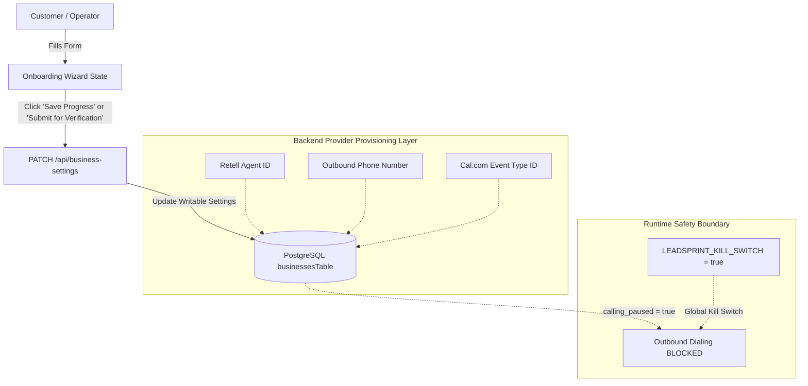

# LeadSprint Phase 4 — Customer Onboarding UI Implementation Summary

## 1. Executive Summary

This document details the implementation of the frontend **Customer Onboarding Experience** for LeadSprint Phase 4. Built to satisfy the specifications in [docs/PHASE4_REAL_CUSTOMER_ONBOARDING_FORM.md](file:///c:/Users/Swetha/Downloads/LeadSprint-Boomi-main/LeadSprint-Boomi-main/docs/PHASE4_REAL_CUSTOMER_ONBOARDING_FORM.md), [docs/PHASE4_REAL_CUSTOMER1_INTAKE_CHECKLIST.md](file:///c:/Users/Swetha/Downloads/LeadSprint-Boomi-main/LeadSprint-Boomi-main/docs/PHASE4_REAL_CUSTOMER1_INTAKE_CHECKLIST.md), and [docs/PHASE4_CUSTOMER_ONBOARDING_UI_AUDIT.md](file:///c:/Users/Swetha/Downloads/LeadSprint-Boomi-main/LeadSprint-Boomi-main/docs/PHASE4_CUSTOMER_ONBOARDING_UI_AUDIT.md), this onboarding portal enables an authorized US real-estate pilot operator or administrator to complete and submit their intake configuration directly through the authenticated LeadSprint web application.

All changes adhere strictly to Phase 4 production safety requirements:
- **No outbound calling activation**: Outbound calling remains disabled.
- **Production kill switches untouched**: `LEADSPRINT_KILL_SWITCH=true` and `calling_paused=true` are preserved.
- **Zero schema modifications**: Utilizes existing database schema and API endpoints (`PATCH /api/business-settings`).
- **No synthetic data**: No synthetic customer profiles or fake sample accounts are populated.

---

## 2. Implemented Components & Routes

### A. Routing & Navigation ([artifacts/leadsprint/src/App.tsx](file:///c:/Users/Swetha/Downloads/LeadSprint-Boomi-main/LeadSprint-Boomi-main/artifacts/leadsprint/src/App.tsx))
- **Dedicated Route**: `/workspace/onboarding` integrated inside `WorkspaceRoute` wrapped by `AuthGate` and the standard dashboard `Shell` layout.
- **Navigation Item**: Added "Customer Onboarding" with a `Sparkles` icon to the primary sidebar navigation menu.
- **Page Metadata**: Added `/workspace/onboarding` entry with proper title ("Customer Onboarding Portal") and section subtitle ("Complete intake configuration for real customer activation verification").
- **Settings Integration**: Added a dedicated navigation link button on the `SettingsPage` (`/workspace/settings`) directing users to the onboarding wizard.

### B. Onboarding Wizard ([artifacts/leadsprint/src/pages/onboarding.tsx](file:///c:/Users/Swetha/Downloads/LeadSprint-Boomi-main/LeadSprint-Boomi-main/artifacts/leadsprint/src/pages/onboarding.tsx))
A 10-step responsive wizard interface with step tracking, draft saving, comprehensive field validations, and safety banners.

| Step | Title | Key Fields & Controls | Persistence & Backend Boundary |
|---|---|---|---|
| **1** | Business Information | Business Legal Name, DBA Name, Website URL, Physical Street Address, Primary Market/City, Business Timezone | `project_name`, `market`, `timezone` persisted via `PATCH /api/business-settings`. `name` is read-only. Address/website kept for intake checklist. |
| **2** | Authorized Operator | Full Name, Professional Title, Direct Email, Direct Mobile Phone, Operator Authority Checkbox | Intake context & Clerk auth verification (validation only) |
| **3** | Telephony & Voice Provider | Retell AI Agent ID, Designated Outbound Phone Number, Escalation/Transfer Phone Number | `transfer_number` persisted via `PATCH /api/business-settings`. Retell Agent ID and Outbound Phone Number are managed through backend/provider configuration. |
| **4** | Calendar & Scheduling | Cal.com Event Type ID, Calendar Booking URL, Timezone Lock, Event Duration | Cal.com Event Type ID is managed through backend/provider configuration. Intake rules validated client-side. |
| **5** | Lead Intake & Compliance | Inbound Source/Webhook Method, CRM Platform, Explicit Consent Capture Text, Mandatory AI Disclosure, Mandatory Recording Disclosure | `ai_disclosure`, `recording_disclosure` persisted via `PATCH /api/business-settings`. Source & consent metadata verified in intake. |
| **6** | Calling Policy | Quiet Hours Window (Start/End Time in local timezone), Max Call Attempts (1–5) | `quiet_hours`, `max_call_attempts` persisted via `PATCH /api/business-settings`. |
| **7** | Voice Agent Scripting | Real Estate FAQ Items (Q&A pairs), Lead Qualification Questions (list), Human Escalation Rules (list) | `approved_faq`, `qualification_questions` persisted via `PATCH /api/business-settings`. Escalation rules validated in intake. |
| **8** | Commercial Agreement | Explicit display of authoritative terms: $500 Setup Fee, $399/mo Base Subscription, 300 Voice Minutes/mo, Managed Billing, Deferred Stripe, and Optional $0.20/min custom overage agreement | Terms Acceptance Checkbox (client-side validation gate) |
| **9** | Review & Confirmation | Complete read-only summary card of all 10 intake sections for pre-submission verification | Client-side validation review |
| **10** | Submission / Pending Verification | "Submit for Verification" action button, draft save confirmation, safety advisory notice, and support contact details | Persists settings via `PATCH /api/business-settings` |

---

## 3. Data Persistence & Safety Architecture



### A. Writable Fields via `PATCH /api/business-settings`
The following fields are directly writable by the onboarding client and durably updated on `businessesTable`:
- `project_name`
- `market`
- `timezone`
- `transfer_number`
- `approved_faq`
- `qualification_questions`
- `recording_disclosure`
- `ai_disclosure`
- `quiet_hours`
- `max_call_attempts`

### B. Backend-Managed Provider Bindings & Read-Only Fields
The following fields exist on `businessesTable` but are **NOT** writable through the client `PATCH /api/business-settings` endpoint:
- **Retell Agent ID (`retell_agent_id`)**: Managed strictly through backend/provider provisioning.
- **Outbound Phone Number (`phone_number`)**: Managed strictly through backend carrier/provider configuration.
- **Cal.com Event Type ID (`cal_event_type_id`)**: Managed strictly through backend/provider configuration.
- **Business Legal/Operating Name (`name`)**: Provisioned during tenant creation; read-only in settings.

> [!IMPORTANT]
> The onboarding client must not imply that provider credentials or telephony bindings can be modified directly through client form submissions. These bindings are configured and verified securely by LeadSprint backend engineers during Stage 4R technical onboarding.

### C. Non-Persisted Intake Metadata
Intake context such as legal entity name, operator direct phone/title, website URL, and CRM platform name are validated in the wizard and documented as intake checklist items without falsely claiming unsupported database columns.

### D. No Automatic Activation & Draft Persistence
- **No Automatic Activation**: The submission button is explicitly labeled **"Submit for Verification"**. It does **not** set `calling_paused=false`, does **not** dispatch live test calls, and does **not** bypass operator verification.
- **Draft Persistence**: Operators can click "Save Progress (Draft)" at any point across steps 1–10 to sync writable business settings to the database without triggering final submission.

---

## 4. Verification & Testing

The implementation was validated against all workspace projects:

1. **TypeScript Typecheck**:
   ```bash
   pnpm run typecheck
   # Output: Scope: 4 of 9 workspace projects -> All passed with 0 errors
   ```
2. **Frontend Production Build**:
   ```bash
   pnpm --filter @workspace/leadsprint build
   # Output: vite build completed successfully in 6.01s (0 errors)
   ```
3. **Automated Unit & Integration Test Suite**:
   ```bash
   pnpm test
   # Output: 12 test files passed, 195 tests passed (100% pass rate)
   ```

---

## 5. Next Steps for Stage 4R Operator Workflow

With the frontend onboarding experience in place, real Customer #1 intake can proceed through the operator workflow:
1. Operator creates the customer workspace/business record.
2. Customer/Operator navigates to `/workspace/onboarding` and completes the 10-step wizard.
3. Customer submits the configuration for verification.
4. LeadSprint team executes [docs/PHASE4_REAL_CUSTOMER1_INTAKE_CHECKLIST.md](file:///c:/Users/Swetha/Downloads/LeadSprint-Boomi-main/LeadSprint-Boomi-main/docs/PHASE4_REAL_CUSTOMER1_INTAKE_CHECKLIST.md) and [docs/PHASE4_STAGE4R_REAL_CUSTOMER_ONBOARDING.md](file:///c:/Users/Swetha/Downloads/LeadSprint-Boomi-main/LeadSprint-Boomi-main/docs/PHASE4_STAGE4R_REAL_CUSTOMER_ONBOARDING.md) to inspect, verify, and prepare for controlled Stage 5 Go-Live.
