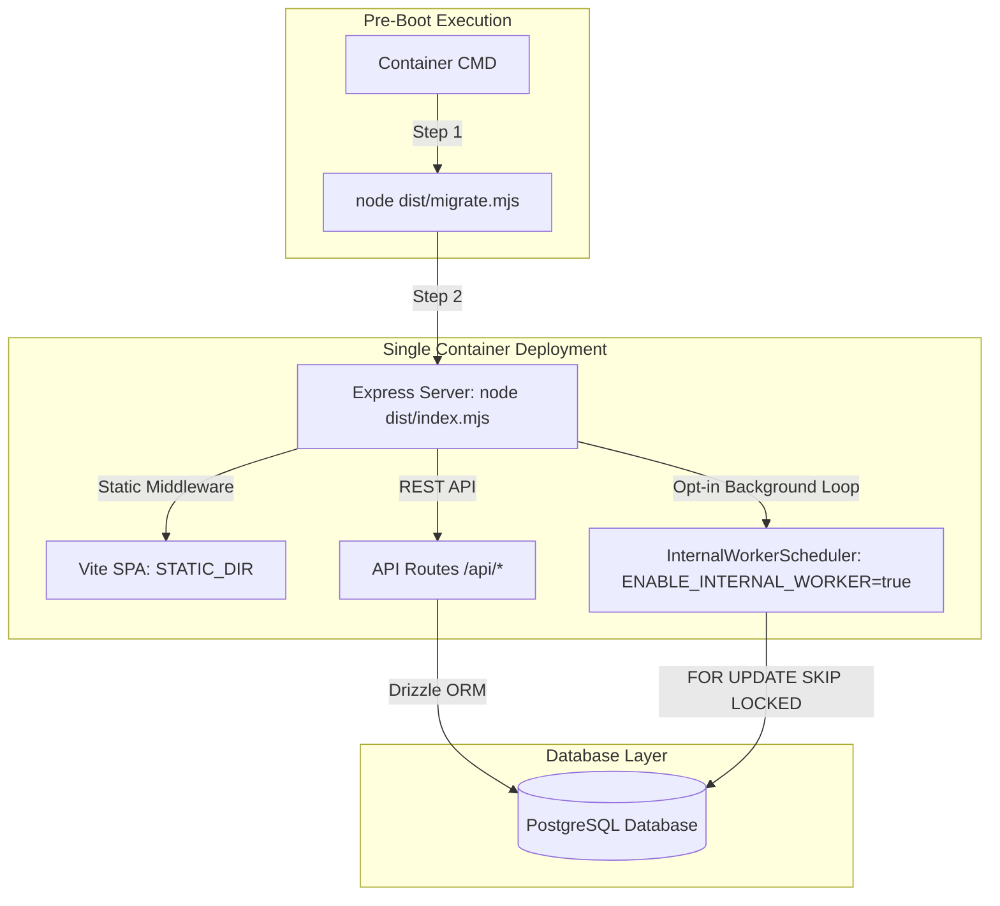

# Phase 4 Stage 1 — Production Readiness

> **Stage:** Phase 4 Stage 1 Production Environment & Secrets Provisioning Inspection  
> **Status:** INSPECTION COMPLETE — READY FOR STAGING PROVISIONING  
> **Baseline Commit:** `31cd2c0f6fdf391d17d0b3c6aaedbcffbebbffbe` (*feat(ops): add calling pause scheduler and contact dispatch safety*)  
> **Branch:** `feature/leadsprint-mvp-hardening`  
> **Authoritative Plan:** `docs/PHASE4_CUSTOMER_PILOT_ONBOARDING_PLAN.md`  

---

## 1. Objective

To perform a comprehensive, code-level production readiness inspection of the LeadSprint repository at baseline commit `31cd2c0`, establishing exact environment variables, provider prerequisites, deployment topology, migration commands, and production safety controls required to launch Stage 1 without exposing secrets or modifying application code.

---

## 2. Current Baseline

| Dimension | Verified Fact |
| :--- | :--- |
| **Commit Baseline** | `31cd2c0f6fdf391d17d0b3c6aaedbcffbebbffbe` |
| **Git Branch** | `feature/leadsprint-mvp-hardening` |
| **Post-M6 Audit Score** | **10.0 / 10** (0 P0, 0 P1 blockers) |
| **Test Pass Rate** | **195 / 195 tests passing** across 12 test suites |
| **TypeScript Status** | **0 errors** across all workspace packages |
| **Working Tree** | Staged/Committed cleanly |

---

## 3. Environment Variables Reference

Audited directly from `artifacts/api-server/src/lib/env.ts`, `.env.example`, `app.ts`, and `index.ts`:

| Variable | Required? | Used By | Purpose | Safe / Default Behavior | Pilot Value / Source |
| :--- | :---: | :--- | :--- | :--- | :--- |
| `DATABASE_URL` | **Yes (in prod)** | `@workspace/db`, `migrate.mjs` | PostgreSQL connection URI | Boot fails if missing when `NODE_ENV=production` | Provisioned PostgreSQL URI |
| `PORT` | Optional | Express server (`index.ts`) | HTTP server listening port | Defaults to `5000` | Host assigned port |
| `NODE_ENV` | Optional | `env.ts`, Express, Pino logger | Runtime mode | Defaults to `"development"` | Set to `"production"` |
| `CRON_SECRET` | **Yes (in prod)** | `routes/cron.ts`, `env.ts` | Auth header (`x-cron-secret`) for `/api/cron/*` | Boot fails if missing/short (<16 chars) in prod | `openssl rand -hex 32` |
| `CLERK_SECRET_KEY` | **Yes (if demo auth off)** | `@clerk/express`, `env.ts` | Clerk backend API authentication secret | Boot fails if missing in prod when demo auth is off | Clerk Dashboard (Production) |
| `CLERK_PUBLISHABLE_KEY` | Optional | Client/Backend Clerk SDK | Clerk publishable key | Required by Clerk client SDK | Clerk Dashboard (Production) |
| `RETELL_API_KEY` | Conditional | `lib/providers.ts`, `env.ts` | Retell AI REST API authentication | Disables live Retell calls if missing | Retell Dashboard |
| `RETELL_WEBHOOK_SECRET` | Conditional | `routes/webhooks.ts`, `env.ts` | Retell HMAC-SHA256 signature check | Disables Retell webhook processing if missing | Retell Webhook Settings |
| `RETELL_AGENT_ID` | Optional | `lib/providers.ts` | Default Retell agent fallback ID | Overridden by `business.retellAgentId` | Retell Dashboard |
| `RETELL_FROM_NUMBER` | Optional | `lib/providers.ts` | Fallback Retell outbound phone number | Overridden by `business.phoneNumber` | Assigned Twilio/Retell number |
| `RETELL_FROM_NUMBER_US` | Optional | `lib/providers.ts` | US market Retell outbound phone number | Overridden by `business.phoneNumber` | Assigned US number |
| `RETELL_FROM_NUMBER_IN` | Optional | `lib/providers.ts` | India market Retell outbound phone number | Overridden by `business.phoneNumber` | Assigned IN number |
| `CALCOM_API_KEY` | Conditional | `lib/providers.ts`, `env.ts` | Cal.com REST API v2 authentication | Disables live Cal.com bookings if missing | Cal.com Settings |
| `CALCOM_WEBHOOK_SECRET` | Conditional | `routes/webhooks.ts`, `env.ts` | Cal.com HMAC-SHA256 signature check | Disables Cal.com webhook processing if missing | Cal.com Webhook Settings |
| `CALCOM_EVENT_TYPE_ID` | Conditional | `lib/providers.ts` | Fallback Cal.com event type ID | Overridden by `business.calEventTypeId` | Cal.com Event Types |
| `CALCOM_API_URL` | Optional | `lib/providers.ts` | Base URL for Cal.com v2 REST API | Defaults to `https://api.cal.com/v2` | Host Cal.com API URL |
| `TWILIO_ACCOUNT_SID` | Conditional | `routes/webhooks.ts`, `env.ts` | Twilio Account SID | Disables Twilio integration if missing | Twilio Console |
| `TWILIO_AUTH_TOKEN` | Conditional | `routes/webhooks.ts`, `env.ts` | Twilio Auth Token for signature check | Disables Twilio webhook validation if missing | Twilio Console |
| `TWILIO_WEBHOOK_SECRET` | Conditional | `routes/webhooks.ts`, `env.ts` | Twilio Webhook secret | Disables Twilio webhooks if missing | Twilio Console |
| `LEAD_INTAKE_WEBHOOK_SECRET` | Optional | `routes/webhooks.ts` | HMAC secret for `POST /api/webhooks/intake` | If missing, signature check skipped with warning log | Generated secret |
| `LEADSPRINT_KILL_SWITCH` | Optional | `lib/policy.ts` | Master safety stop for all outbound calling | Defaults to `false`; if `true`, halts all new calls | Defaults `false` |
| `ENABLE_INTERNAL_WORKER` | Optional | `lib/scheduler.ts`, `env.ts` | Enables in-process background worker timer loop | Defaults to `false` (disabled); set to `"true"` to activate | Set `"true"` for standalone container |
| `INTERNAL_WORKER_INTERVAL_MS` | Optional | `lib/scheduler.ts`, `env.ts` | Poll interval for internal worker loop | Defaults to `30000`ms (30s); bounded 5000ms–300000ms | Set `30000` |
| `CORS_ALLOWED_ORIGINS` | Optional | `app.ts` | Whitelist of allowed CORS origins | Restricts requests to allowed domain list in prod | Host SPA domain URL |
| `TRUST_PROXY` | Optional | `app.ts` | Number of trusted reverse proxy hops | Defaults to `1` (Coolify/Traefik = 1) | Set `1` for proxy |
| `LOG_LEVEL` | Optional | `lib/logger.ts` | Pino logger verbosity level | Defaults to `"info"` | Set `"info"` |
| `LEADSPRINT_DEMO_AUTH` | Optional | `routes/leadsprint.ts`, `env.ts` | Local demo authentication bypass | Server **refuses** when `NODE_ENV=production` | Must be `false` in prod |

---

## 4. Provider Prerequisites

### A. Retell AI Telephony
- **API Key:** Secret key for `https://api.retellai.com` REST API calls.
- **Agent ID:** Agent prompt configured with approved business FAQ and qualification guidelines.
- **Webhook Endpoint:** `https://api.domain.com/api/webhooks/retell` registered in Retell dashboard.
- **Webhook Secret:** Secret string matching `RETELL_WEBHOOK_SECRET` for HMAC-SHA256 signature verification.

### B. Twilio Telephony
- **Credentials:** Account SID and Auth Token (`TWILIO_ACCOUNT_SID`, `TWILIO_AUTH_TOKEN`).
- **Phone Number:** E.164 phone number assigned to business tenant.
- **Webhook Endpoint:** `https://api.domain.com/api/webhooks/twilio/status` registered in Twilio Console.
- **Webhook Secret:** Signature secret matching `TWILIO_WEBHOOK_SECRET`.

### C. Cal.com Calendar
- **API Key:** Cal.com REST API v2 key (`CALCOM_API_KEY`).
- **Event Type ID:** Numerical/string ID matching `CALCOM_EVENT_TYPE_ID` or tenant `business.calEventTypeId`.
- **Webhook Endpoint:** `https://api.domain.com/api/webhooks/calcom` registered in Cal.com dashboard.
- **Webhook Secret:** Signing secret matching `CALCOM_WEBHOOK_SECRET`.

### D. Clerk Authentication
- **Production Instance:** Clerk application configured in production mode.
- **API Keys:** `CLERK_SECRET_KEY` and `CLERK_PUBLISHABLE_KEY` configured in server environment.

---

## 5. Deployment Topology

Audited directly from `Dockerfile`, `index.ts`, `app.ts`, and `scheduler.ts`:



- **API & Frontend Unified Process:** Express process runs on `PORT` (default 5000) serving REST APIs and static SPA assets from `STATIC_DIR=/repo/artifacts/leadsprint/dist/public`.
- **Database:** Single PostgreSQL 14+ database instance.
- **Redis Requirement:** **NONE (Not Required)**. The architecture relies on PostgreSQL `FOR UPDATE SKIP LOCKED` row locking for worker job queues. Redis is not used.
- **Worker Execution:** `InternalWorkerScheduler` in `scheduler.ts` runs non-overlapping `setTimeout` ticks when `ENABLE_INTERNAL_WORKER=true`. External HTTP cron (`POST /api/cron/process-jobs`) can coexist safely.
- **Pre-Boot Migration Runner:** Executed in Docker CMD before process launch via `node artifacts/api-server/dist/migrate.mjs`.
- **Health Probes:** `GET /api/healthz` (liveness) and `GET /api/readyz` (readiness & provider check).
- **Graceful Shutdown:** `SIGTERM`/`SIGINT` stops background scheduler (up to 10s wait) before closing HTTP server.

---

## 6. Migration Procedure

- **Runner Script:** `artifacts/api-server/src/migrate.ts` compiled to `dist/migrate.mjs` using `drizzle-orm/node-postgres/migrator`.
- **Execution Command:** `node artifacts/api-server/dist/migrate.mjs` (run from `/repo`).
- **Required Environment:** `DATABASE_URL` pointing to PostgreSQL instance.
- **Verification of Unexecuted Migration `0005`:**
  Run SQL query:
  ```sql
  SELECT column_name FROM information_schema.columns 
  WHERE table_name = 'businesses' AND column_name = 'calling_paused';
  ```
  Returns `0` rows if migration `0005` has not yet been executed.

---

## 7. Production Safety Controls

1. **`LEADSPRINT_KILL_SWITCH`:** Defaults to `"false"`. If set to `"true"`, immediately halts all outbound call dispatches across all businesses.
2. **`ENABLE_INTERNAL_WORKER`:** Set to `"true"` for standalone single-container deployments; defaults to `"false"`.
3. **CORS Whitelist:** Restricts API origin access via `CORS_ALLOWED_ORIGINS`.
4. **Rate Limiting:** `express-rate-limit` enforces 120 req/min on webhooks and 20 req/min on cron endpoints.
5. **PII & Secret Redaction:** Pino logger redacts `authorization`, `x-cron-secret`, `x-retell-signature`, `x-cal-signature-256`, and full phone numbers.
6. **Demo Auth Rejection:** Server explicitly throws hard error and refuses to start if `LEADSPRINT_DEMO_AUTH=true` when `NODE_ENV=production`.
7. **Fail-Closed Provider Boundaries:** Missing provider credentials disable that specific provider gracefully (reported on `/api/readyz`) without crashing the application process.

---

## 8. Build & Startup Commands

Audited from `package.json` scripts:

- **Dependency Installation:** `pnpm install --frozen-lockfile`
- **TypeScript Typecheck:** `pnpm run typecheck`
- **API Server Build:** `pnpm --filter "@workspace/api-server" run build` (outputs `dist/index.mjs` & `dist/migrate.mjs`)
- **Frontend SPA Build:** `pnpm --filter "@workspace/leadsprint" run build` (outputs `dist/public/`)
- **Standalone API Start:** `node --enable-source-maps artifacts/api-server/dist/index.mjs`
- **Migration Execution:** `node artifacts/api-server/dist/migrate.mjs`
- **Container CMD:** `sh -c "node artifacts/api-server/dist/migrate.mjs && node --enable-source-maps artifacts/api-server/dist/index.mjs"`

---

## 9. Pre-Staging Prerequisites

The following prerequisites must be provisioned before Stage 2 staging migration verification:
- [ ] Staging PostgreSQL 14+ database instance.
- [ ] Staging `DATABASE_URL` connection string.
- [ ] Generated staging `CRON_SECRET` (`openssl rand -hex 32`).

---

## 10. Pre-Production Prerequisites

The following prerequisites must be provisioned before Stage 4 production deployment:
- [ ] Production PostgreSQL 14+ database instance with SSL.
- [ ] Production Clerk instance keys (`CLERK_SECRET_KEY`, `CLERK_PUBLISHABLE_KEY`).
- [ ] Production Retell API key & webhook secret (`RETELL_API_KEY`, `RETELL_WEBHOOK_SECRET`).
- [ ] Production Cal.com API key & webhook secret (`CALCOM_API_KEY`, `CALCOM_WEBHOOK_SECRET`).
- [ ] Production Twilio Account SID, Auth Token & Webhook secret.
- [ ] HTTPS domain & SSL proxy setup (`TRUST_PROXY=1`, `CORS_ALLOWED_ORIGINS`).
- [ ] Dedicated business phone number (E.164) & test phone number.

---

## 11. Missing Items / Blockers Classification

| Item | Classification | Rationale |
| :--- | :---: | :--- |
| **Production PostgreSQL Database** | **REQUIRED BEFORE PRODUCTION** | Required for persistent multi-tenant data storage. |
| **Production Clerk Credentials** | **REQUIRED BEFORE PRODUCTION** | Required for authenticated operator login when demo auth is off. |
| **Retell & Cal.com Live Credentials** | **REQUIRED BEFORE PRODUCTION** | Required for live voice qualification & showing booking. |
| **Redis Cache / Broker** | **NOT REQUIRED / OPTIONAL** | Current architecture uses PostgreSQL `FOR UPDATE SKIP LOCKED`. |
| **Custom Queue Infrastructure** | **NOT REQUIRED / OPTIONAL** | Internal worker loop (`scheduler.ts`) provides full queue capability. |

---

## 12. Secret & Security Review

- **Commit Verification:** No real API keys, connection strings, or secrets exist in committed repository files.
- **Example File Placeholders:** `.env.example` contains placeholders only.
- **Git Ignore Security:** `.gitignore` excludes `.env`, `.env.local`, `.env.production`, `node_modules`, and `dist`.
- **Logger Protection:** `pino-http` logger serializers redact authorization headers, webhook signing headers, and phone numbers.

---

## 13. Stage 1 Completion Gate

- [x] Required production environment variables identified and documented.
- [x] Zero secret values exposed or logged.
- [x] Provider credentials and prerequisites categorized.
- [x] Deployment topology verified (single process, zero Redis dependency).
- [x] Migration execution command (`node artifacts/api-server/dist/migrate.mjs`) identified; **NOT executed**.
- [x] Production safety controls verified.
- [x] Staging and production prerequisites clearly classified.

---

## 14. Next Recommended Action

**PROCEED TO STAGE 2 — STAGING DATABASE MIGRATION & SCHEMA AUDIT.**

Provision the staging PostgreSQL database connection string and execute migration `0005_calling_paused.sql` in the staging environment.
