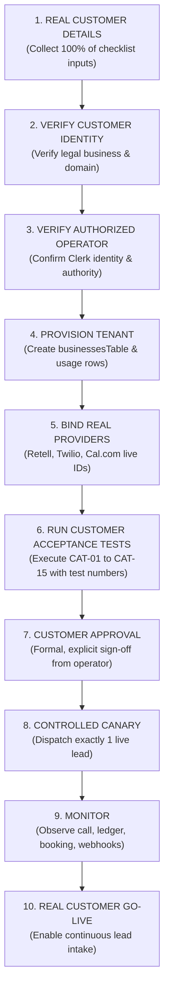

# Phase 4 Stage 4R — Real Customer Onboarding & Activation Specification

> **Status:** REAL CUSTOMER ONBOARDING SPECIFICATION (ACTIVE)  
> **Real Customer #1 Onboarding Status:** **NOT YET ONBOARDED**  
> **Production Customer Traffic:** **DISABLED**  
> **Outbound Calling:** **DISABLED**  
> **Customer Authorization:** **NOT RECEIVED**  
> **Safety State:** `LEADSPRINT_KILL_SWITCH=true` | `calling_paused=true`  
> **Baseline Commit:** `31cd2c0f6fdf391d17d0b3c6aaedbcffbebbffbe`  
> **Governing Documents:** [PHASE4_CUSTOMER_PILOT_ONBOARDING_PLAN.md](file:///c:/Users/Swetha/Downloads/LeadSprint-Boomi-main/LeadSprint-Boomi-main/docs/PHASE4_CUSTOMER_PILOT_ONBOARDING_PLAN.md), [PHASE4_STAGE4_CUSTOMER1_ACTIVATION.md](file:///c:/Users/Swetha/Downloads/LeadSprint-Boomi-main/LeadSprint-Boomi-main/docs/PHASE4_STAGE4_CUSTOMER1_ACTIVATION.md)

---

## 1. Discovery & Historical Clarification

An audit of the Phase 4 documentation revealed that the entity previously designated as "Customer 1 — Northstar Realty" was **SAMPLE / SYNTHETIC TEST DATA**, and **NOT** a real customer.

### Established Evidence:
1. **Fictional Identity:** `maya@northstarrealty.example` uses the RFC 2606 reserved `.example` domain and is a purely synthetic identity.
2. **Fictional Telephony:** Phone numbers `+15125550199` and `+15125550188` fall within the reserved fictional 555-0100 through 555-0199 range.
3. **Simulated IDs:** Identifiers such as `biz_c1_northstar_realty`, `user_c1_northstar_operator`, `agent_7a8b9c10`, `v1.2-prod`, and Cal.com event type `149281` were generated for acceptance test modeling in Phase 4 and are not bound to live production third-party resources.
4. **Seed Isolation:** The actual repository demo seed uses `business_demo` and `user_demo` with environment guards preventing production seed injection.

### Mandatory Operational Determinations:
- **Northstar Realty must NOT be treated as a real customer.**
- **No real customer authorization exists.**
- **No real customer tenant has been activated.**
- **No real customer traffic has been processed.**
- **The existing production system remains under full safety controls (`LEADSPRINT_KILL_SWITCH=true`, `calling_paused=true`).**

---

## 2. Prohibition on Synthetic / Sample Data Substitution

When onboarding real commercial customers, engineers and operators must adhere strictly to the following rules:

> [!CAUTION]
> **STRICT BAN ON FABRICATED ONBOARDING DATA:**
> - **NEVER** replace missing customer information with placeholder or fabricated values.
> - **NEVER** use `.example` or fake email domains for real customer operators.
> - **NEVER** use fictional 555 numbers for outbound caller IDs or human transfer destinations.
> - **NEVER** fabricate Retell agent IDs, Retell versions, or Twilio SIDs.
> - **NEVER** fabricate Cal.com event type IDs or availability calendars.
> - **NEVER** claim provider bindings are verified without actively confirming configuration against live provider consoles/APIs.
> - **NEVER** claim customer authorization without formal, explicit, written confirmation from an authorized human operator.

---

## 3. Real Customer Information Checklist

Before any provisioning or activation activities begin, all fields in this checklist must be collected directly from the customer and verified:

### A. Business Entity & Desk
- [ ] **Legal / Registered Business Name:** Official corporate/LLC name.
- [ ] **Operating / DBA Name:** Consumer-facing agency/desk name.
- [ ] **Target US Location:** State, city, and primary market jurisdiction.
- [ ] **Business Timezone:** Canonical IANA timezone (e.g., `America/New_York`, `America/Chicago`, `America/Los_Angeles`).
- [ ] **Business Hours:** Mon–Fri operational window in local business timezone (e.g., `09:00–18:00`).
- [ ] **Quiet Hours Window:** Strictly enforced non-calling window (default: `21:00–08:00` in both lead and business timezones).

### B. Authorized Operator
- [ ] **Primary Operator Name:** Full name of designated customer administrator.
- [ ] **Business Email Address:** Live corporate email on customer domain (non-example domain).
- [ ] **Clerk User Identity:** Verified Clerk user ID (`user_<uuid>`) provisioned and confirmed via auth.
- [ ] **Role & Authorization Confirmation:** Explicit verification that the user possesses operational authority to approve outbound calling.

### C. Telephony & Provider Configuration
- [ ] **Real Dedicated Business Phone Number:** E.164 provisioned number assigned to the business (e.g., via Twilio).
- [ ] **Twilio Configuration:** Verified Account SID, registered outbound caller ID, and status webhook URLs (`/api/webhooks/twilio/status`).
- [ ] **Retell Agent ID:** Active, production Retell agent ID bound to the customer voice model.
- [ ] **Retell Agent Version:** Deployed production voice agent prompt/model version tag.
- [ ] **Outbound Caller ID:** Customer-verified outbound phone number display.
- [ ] **Human Transfer Destination:** Live, verified phone number for operator transfer/escalation during calls.

### D. Calendar Integration
- [ ] **Cal.com Account / Calendar:** Customer Cal.com account linked to LeadSprint.
- [ ] **Event Type ID:** Live Cal.com showing / consultation event type ID.
- [ ] **Appointment Duration:** Configured duration in minutes (e.g., 30m, 45m).
- [ ] **Availability Schedule:** Active host availability rules configured in Cal.com.
- [ ] **Attendee Timezone Behavior:** Confirmed automatic conversion between attendee local time and operator calendar.

### E. Inbound Lead Intake & Qualification
- [ ] **Lead Source:** Website form, Facebook Lead Ad webhook, Zillow Connect, or CRM webhook.
- [ ] **Webhook / Source Identity:** Secure endpoint URL and authentication secret/token.
- [ ] **Expected Lead Fields:** Schema validation mapping (First Name, Last Name, Phone, Email, Location, Budget, Timeline).
- [ ] **Qualification Requirements:** Mandatory criteria evaluated by Retell AI (e.g., purchase timeframe < 90 days, target zip code, pre-approval status).

### F. Compliance & Provenance
- [ ] **Consent Collection Process:** Documented affirmative TCPA opt-in mechanism on intake form.
- [ ] **Consent Evidence & Source:** Storage of consent timestamp, form URL, IP address, and disclosure version string.
- [ ] **DNC / Suppression Process:** Established process for handling opt-outs and updating `contactsTable.suppressedAt`.
- [ ] **Disclosure Language:** AI disclosure text included in greeting (e.g., "This is an automated assistant on a recorded line...").
- [ ] **Timezone & Location Provenance:** Method for validating lead phone number area code / zip code timezone prior to calling.

### G. Voice Agent Configuration
- [ ] **Custom Greeting:** Tailored opening statement including business name and disclosure.
- [ ] **Qualification Questions:** Ordered list of screening questions.
- [ ] **Approved FAQs:** Verified business knowledge base and bounds.
- [ ] **Handoff Conditions:** Specific triggers that initiate transfer to human operator (e.g., lead requests agent, complex financing).
- [ ] **Booking Conditions:** Criteria required before offering calendar appointment.
- [ ] **Escalation & Fallback Behavior:** Defined workflow when transfer fails (e.g., task created on Today desk).

### H. Commercial Terms
- [ ] **Executed Pilot Agreement:** Signed commercial pilot contract.
- [ ] **Subscription Baseline:** **$399 / month baseline**.
- [ ] **Voice Minutes Entitlement:** **300 included voice minutes / month**.
- [ ] **Billing Execution:** Managed / manual invoice billing (self-serve Stripe checkout deferred).
- [ ] **Customer-Specific Terms:** Any custom SLAs, overage rates ($0.20/min), or pilot term lengths.

---

## 4. Real Customer Activation Gate Sequence

Every real customer must progress through the strict 10-stage activation gate prior to live traffic:

### Gate Definitions:
1. **Real Customer Details:** Complete all sections of the Real Customer Information Checklist. Zero placeholder data permitted.
2. **Verify Customer Identity:** Confirm business entity legitimacy and corporate domain ownership.
3. **Verify Authorized Operator:** Authenticate primary user via Clerk; verify authorized role mapping.
4. **Provision Tenant:** Insert business record into `businessesTable` (`callingPaused = true`, `includedVoiceMinutes = 300`) and initialize active period row in `usageTable`.
5. **Bind Real Providers:** Bind real Retell Agent ID, Twilio phone number, and Cal.com event type ID.
6. **Run Customer Acceptance Tests:** Execute CAT-01 through CAT-15 suite using controlled internal test numbers. Confirm 100% pass rate.
7. **Customer Approval:** Present test results to authorized customer operator and receive explicit written authorization to activate outbound calling.
8. **Controlled Canary:** Unpause calling for this specific tenant (`calling_paused = false`), keeping unrelated tenants paused. Ingest **exactly one** real canary lead and observe full lifecycle.
9. **Monitor:** Audit duration ledgering in `usageTable`, Retell call recording/transcript, Cal.com appointment, and webhook responses.
10. **Real Customer Go-Live:** Declare customer live and connect production inbound webhook feed.

---

## 5. Current Production Safety Controls

The LeadSprint production environment is configured with multi-tiered safety locks to ensure zero unauthorized dispatches:

| Safety Layer | Current State | Function |
| :--- | :---: | :--- |
| **Global Kill Switch** | `LEADSPRINT_KILL_SWITCH=true` | Master circuit breaker overriding all tenant dispatchers. |
| **Tenant Calling Pause** | `calling_paused=true` | Tenant-level dispatch gate. All tenants are held paused. |
| **Outbound Telephony** | **DISABLED** | Zero automated or manual outbound calls dispatched. |
| **Customer Traffic** | **DISABLED** | Zero live lead traffic ingested. |
| **Customer Authorization** | **NOT RECEIVED** | Awaiting real customer onboarding and explicit operator sign-off. |

---

## 6. Change Control & Governance

- **Scope:** Documentation and operational onboarding readiness only.
- **Application Code:** 0 code changes.
- **Schema & Migrations:** 0 schema or DDL modifications.
- **Database Records:** No production customer records altered.
- **Deployment Status:** No deployments performed.
- **Git Actions:** No commits or pushes performed.
