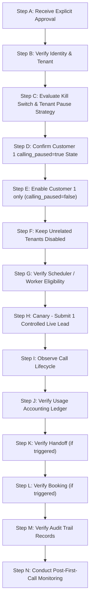

# Phase 4 Stage 5 — Customer 1 Go-Live Activation Runbook

> **Stage:** Phase 4 Stage 5 Customer 1 Go-Live Activation Runbook (TEMPLATE / SAMPLE DATA)  
> **Notice:** "Northstar Realty" and associated identifiers (`biz_c1_northstar_realty`, `maya@northstarrealty.example`, `+15125550199`) are **SAMPLE / TEST DATA** used as a reference template. No real customer has been onboarded, authorized, or activated. Real customer onboarding is governed by [PHASE4_STAGE4R_REAL_CUSTOMER_ONBOARDING.md](file:///c:/Users/Swetha/Downloads/LeadSprint-Boomi-main/LeadSprint-Boomi-main/docs/PHASE4_STAGE4R_REAL_CUSTOMER_ONBOARDING.md).  
> **Target Tenant:** Customer 1 Reference Template — Northstar Realty (`biz_c1_northstar_realty` - Sample Data)  
> **Current Activation Status:** **REFERENCE RUNBOOK / AWAITING REAL CUSTOMER ONBOARDING**  
> **Live Calling Status:** **NOT ACTIVATED (`ACTIVATED: NO`)**  
> **Safety State:** `calling_paused = true` | `LEADSPRINT_KILL_SWITCH = true` (**Real Customer Traffic DISABLED**)  
> **Baseline Commit:** `31cd2c0`  
> **Prerequisite Stage Reports:** `docs/PHASE4_STAGE4_CUSTOMER1_ACTIVATION.md` (**PASS** - Test Suite Verified)  

---

## 1. Purpose

This document provides the standard operational procedure and runbook for Phase 4 Stage 5: controlled Customer 1 (Northstar Realty) go-live activation.

Stage 5 defines the exact step-by-step procedure to transition Customer 1 from a verified pre-activation state (`calling_paused = true`) to active live lead intake and outbound dispatch. This runbook is to be executed **only** after explicit, verified authorization from an authorized Northstar Realty operator.

---

## 2. Current State

The technical readiness of Customer 1 was fully verified during Phase 4 Stage 4. The system is currently holding in a secure pre-activation state:

- **Customer 1 Status:** **READY FOR CUSTOMER ACTIVATION**
- **Tenant Business ID:** `biz_c1_northstar_realty`
- **Authorized Operator:** `user_c1_northstar_operator` (`maya@northstarrealty.example`)
- **Tenant Calling Pause State:** `calling_paused = true`
- **Global Safety Switch State:** `LEADSPRINT_KILL_SWITCH = true`
- **Real Customer Traffic:** **DISABLED**
- **Customer Authorization:** **PENDING (NOT YET RECEIVED)**
- **Deployed Production Commit:** `31cd2c0`
- **Applied Database Migrations:** Up through `0005_add_calling_paused_to_businesses.sql`
- **Acceptance Test Execution:** CAT-01 through CAT-14 PASSED in production (using test data only); CAT-15 PASSED in staging.
- **Open Defects / Incidents:** P0: 0, P1: 0, P2: 2 (deferred non-critical polish).

---

## 3. Required Authorization

> [!IMPORTANT]
> **Technical readiness does not constitute authorization to activate live outbound calling.**

Activation of live outbound calling for Customer 1 must **NOT** occur until formal, written, or recorded explicit approval is received from an authorized Northstar Realty operator (`maya@northstarrealty.example` / Clerk User ID `user_c1_northstar_operator`).

- **Authorizing Role:** Designated Northstar Realty Agency Operator or Commercial Administrator.
- **Verification Rule:** Engineers and operators MUST verify that the authorization originates from the verified Clerk user `user_c1_northstar_operator` bound to `biz_c1_northstar_realty`.
- **Prohibition:** Neither automated schedulers, deployment pipelines, nor engineering personnel may self-authorize or assume authorization.

---

## 4. Pre-Activation Checklist

Before initiating the activation sequence, the operator or engineer must verify each item in this pre-activation checklist:

| Verification Item | Target Value / Specification | Verification Status |
| :--- | :--- | :---: |
| **1. Production Health Endpoint** | `GET /api/health` returns HTTP 200 (`status: "healthy"`) | [ ] Pending Approval |
| **2. Production Readiness Endpoint** | `GET /api/readiness` returns HTTP 200 (`status: "ready"`) | [ ] Pending Approval |
| **3. Customer Tenant Existence** | Record `biz_c1_northstar_realty` exists in `businessesTable` | [ ] Pending Approval |
| **4. Operator Identity Linkage** | Clerk user `user_c1_northstar_operator` bound to tenant | [ ] Pending Approval |
| **5. Business Timezone** | `America/Chicago` (Central Time) | [ ] Pending Approval |
| **6. Business Hours Window** | Monday – Friday, 09:00 – 18:00 CT | [ ] Pending Approval |
| **7. Quiet Hours Window** | 21:00 – 08:00 CT (Calling strictly prohibited) | [ ] Pending Approval |
| **8. Voice Entitlement Ledger** | `includedVoiceMinutes = 300` in active `usageTable` row | [ ] Pending Approval |
| **9. Retell Agent Binding** | Agent ID `agent_7a8b9c10` (Version `v1.2-prod`) verified | [ ] Pending Approval |
| **10. Dedicated Business Phone** | `+15125550199` provisioned and bound | [ ] Pending Approval |
| **11. Twilio Routing & Webhook** | Status callback configured to `/api/webhooks/twilio/status` | [ ] Pending Approval |
| **12. Cal.com Calendar Integration** | Event Type ID `149281` (Showing Appointment) bound | [ ] Pending Approval |
| **13. Consent & DNC Policy** | TCPA compliance disclosures & UI opt-out suppression verified | [ ] Pending Approval |
| **14. Human Handoff Destination** | Transfer target number `+15125550188` verified | [ ] Pending Approval |
| **15. Test Data Isolation** | Customer test leads purged/isolated from live lead intake pipeline | [ ] Pending Approval |
| **16. Open Defect Count** | P0: 0, P1: 0 (Zero blocking defects) | [ ] Pending Approval |
| **17. Backup & Recovery** | Production DB snapshot taken and point-in-time recovery available | [ ] Pending Approval |

---

## 5. Activation Sequence

When explicit authorized operator approval is received, follow this exact, controlled 14-step sequence:



### Sequence Details:

- **Step A — Obtain Explicit Approval:** Receive formal approval notification from `maya@northstarrealty.example`.
- **Step B — Verify Identity & Tenant:** Confirm the approving user ID matches `user_c1_northstar_operator` for tenant `biz_c1_northstar_realty`.
- **Step C — Evaluate Kill Switch & Tenant Pause Strategy:**
  - Customer authorization does **NOT** automatically require setting `LEADSPRINT_KILL_SWITCH = false`.
  - **Preferred Path:** Keep `LEADSPRINT_KILL_SWITCH = true` and enable Customer 1 solely by setting `calling_paused = false` for `biz_c1_northstar_realty`.
  - **Conditional Override:** Only disable the global kill switch (`LEADSPRINT_KILL_SWITCH = false`) if the existing production implementation technically requires it for outbound dispatch.
  - **Verification Guardrail:** If `LEADSPRINT_KILL_SWITCH` must be set to `false`, explicitly verify that all unrelated tenants remain strictly `calling_paused = true` before proceeding.
- **Step D — Confirm Customer 1 Pause State:** Confirm `calling_paused = true` is currently set for `biz_c1_northstar_realty`.
- **Step E — Enable Customer 1 Outbound Calling ONLY:** Set `calling_paused = false` specifically for `biz_c1_northstar_realty`.
- **Step F — Keep Unrelated Tenants Disabled:** Ensure all other tenant accounts remain `calling_paused = true`.
- **Step G — Verify Scheduler / Worker Policy Eligibility:** Verify background worker and policy evaluator (`evaluateCallPolicy()`) evaluate Customer 1 dispatches as eligible under normal worker policy.
- **Step H — Submit Canary Lead:** Submit/allow **exactly one** controlled live lead into the intake pipeline to initiate the canary first call.
- **Step I — Observe Call Lifecycle:** Monitor transition across states (`created` $\rightarrow$ `queued` $\rightarrow$ `in_progress` $\rightarrow$ `completed`).
- **Step J — Verify Usage Accounting:** Inspect `usageTable` to confirm duration minutes were accurately computed and deducted from the 300-minute allocation.
- **Step K — Verify Handoff (If Applicable):** If live transfer was requested during call, confirm transfer routing to `+15125550188`.
- **Step L — Verify Booking (If Applicable):** If appointment was booked, confirm record in `appointmentsTable` and Cal.com integration.
- **Step M — Verify Audit Records:** Confirm structured audit log entry generated in `auditLogsTable`.
- **Step N — Monitor Post-First-Call:** Keep system under close observation for 15 minutes before enabling general lead intake.

---

## 6. Safety Requirements

During execution of this runbook, the following actions are **STRICTLY PROHIBITED**:

> [!CAUTION]
> 1. **NO Bulk Activation:** Never unpause multiple tenants or enable bulk un-throttled lead queues simultaneously.
> 2. **NO Activation of Unrelated Tenants:** Activation is strictly scoped to `biz_c1_northstar_realty`. All other tenant accounts must remain paused.
> 3. **NO Unnecessary Disabling of Global Safety Controls:** Customer authorization does not automatically imply disabling `LEADSPRINT_KILL_SWITCH`. Keep `LEADSPRINT_KILL_SWITCH = true` unless technically required by the dispatch engine. If disabled, verify all unrelated tenants are paused first.
> 4. **NO Worker Policy Bypassing:** Never bypass worker evaluation policy. The worker must strictly enforce `evaluateCallPolicy()`, consent, DNC, tenant authorization, usage entitlement, business hours, and quiet hours.
> 5. **NO Manual Worker Bypass:** Manual calls to `/api/cron/process-jobs` are NOT a required step for activation; processing must happen naturally via the configured internal scheduler. Where used as an operational trigger, it must never bypass worker policy.
> 6. **NO Direct Provider Calls Outside Application:** Do not initiate telephony via raw Retell or Twilio API calls outside LeadSprint's orchestrated application workflow.
> 7. **NO Testing with Real Customer Data Prior to Authorization:** Real customer lead data must never be processed during dry-run or testing activities.
> 8. **NO Schema or Migration Changes During Activation:** Database migrations and code deployments must remain frozen (`31cd2c0`).

---

## 7. First-Call Procedure

The go-live activation relies on a **Single-Lead Canary Approach** using the normal production background worker through the configured internal scheduler:

### Canary Call Criteria & Gates:
1. **Tenant Assignment:** Must belong exclusively to Customer 1 (`biz_c1_northstar_realty`).
2. **Workflow Authorization & Job Processing:** Must arrive via Customer 1's configured lead intake workflow and process through standard workflow job processing (`workflowJobsTable`).
3. **Internal Scheduler Processing:** Must be claimed and executed automatically by the normal production background worker via the configured internal scheduler. Manually triggering `/api/cron/process-jobs` is **NOT** a required activation step (though available as an operational trigger where applicable) and must **NEVER** bypass normal worker policy.
4. **Mandatory Policy Gates:** The canary call MUST successfully pass all of the following checks:
   - `evaluateCallPolicy()`
   - TCPA affirmative consent verification
   - Do-Not-Call (DNC) suppression lookup
   - Business hours check (Mon–Fri 09:00–18:00 CT)
   - Quiet hours restriction check (21:00–08:00 CT)
   - Tenant authorization check (`biz_c1_northstar_realty` active & bound)
   - Usage entitlement check (deducted against 300-minute baseline in `usageTable`)
   - Normal workflow job processing pipeline
5. **Observability:** Must be tracked end-to-end through normal call lifecycle monitoring.

---

## 8. Immediate Rollback

If any anomaly, unexpected event, policy failure, or error occurs during activation or during the canary call:

> [!WARNING]
> **IMMEDIATE ROLLBACK TRIGGER PROCEDURE:**
> 1. **Engage Tenant Safety Pause:** Immediately set `calling_paused = true` for `biz_c1_northstar_realty` via operator console or API endpoint (`POST /api/settings/pause`).
> 2. **Engage Global Master Halt (If Necessary):** If unexpected cross-tenant or un-gated dispatches occur, set `LEADSPRINT_KILL_SWITCH = true` in production environment and restart API containers.
> 3. **Halt Outbound Dispatch:** Ensure background worker process halts all new job claiming immediately.
> 4. **Do NOT Manipulate Telephony State Arbitrarily:** Do not manually modify ongoing provider telephony state unless required by standard emergency provider recovery runbooks.
> 5. **Preserve Audit Evidence:** Capture raw application logs, database state snapshots, provider webhook payloads, and call logs for post-mortem analysis.
> 6. **Root-Cause Investigation:** Conduct thorough root-cause investigation and issue a resolution plan before attempting re-activation.

---

## 9. Post-First-Call Verification

Immediately after the canary call reaches terminal state (`completed`), execute the following verification audit:

- [ ] **Call Terminal Status:** Confirm call status is `completed` (or valid customer terminal state).
- [ ] **Provider Call ID Matching:** Confirm `retellCallId` in `callsTable` matches Retell backend record.
- [ ] **Usage Minutes Ledger:** Confirm call duration was rounded correctly and deducted in `usageTable`.
- [ ] **Workflow Job Status:** Confirm job status in `workflowJobsTable` updated to `completed`.
- [ ] **Lead / Contact Records:** Confirm contact and lead status updated properly in `contactsTable` and `leadsTable`.
- [ ] **Audit Trail Record:** Confirm log entry recorded in `auditLogsTable` with proper user/system attribution.
- [ ] **Operator Handoff Verification:** If transfer occurred, confirm successful call routing to `+15125550188`.
- [ ] **Appointment Booking Verification:** If showing was booked, confirm entry in `appointmentsTable` and Cal.com confirmation.
- [ ] **Duplicate Call Check:** Confirm exact 1:1 ratio between intake lead and outbound call (zero duplicate dispatches).
- [ ] **Duplicate Billing Check:** Confirm single usage entry recorded for the call (zero duplicate ledger debits).
- [ ] **Provider Event Integrity:** Confirm 100% of Retell and Twilio webhooks returned HTTP 200 OK.
- [ ] **Policy Enforcement Audit:** Confirm no quiet hours or DNC bypass occurred.

---

## 10. Go-Live Success Criteria

Stage 5 Go-Live Activation is declared **SUCCESSFUL** when all of the following conditions are met:

1. **First Authorized Call Completed:** The single-lead canary call completes end-to-end without application or telephony error via normal scheduled worker processing.
2. **Usage Reconciled:** Voice minute usage is accurately calculated and ledgered against Northstar Realty's 300-minute baseline entitlement.
3. **Zero Duplicate Calls:** Intake processing places exactly one call per lead without duplicate dispatch.
4. **Zero Duplicate Billing:** No duplicate usage ledger debits are created.
5. **Policy Enforcement Intact:** Consent, DNC, business hours, and quiet hours controls function cleanly under `evaluateCallPolicy()`.
6. **Operator Visibility:** The operator console reflects live status, call logs, and entitlement balances in real time.
7. **Zero High-Severity Incidents:** Zero P0 or P1 incidents or safety violations reported during or immediately following activation.

---

## 11. Monitoring Baseline

Operational monitoring must maintain alignment with the Stage 4 baseline metrics:

| Metric | Target / Enforced Limit | Go-Live Baseline Target |
| :--- | :--- | :--- |
| **Inbound Leads Received** | Dynamic | Monitored real-time |
| **Voice Minutes Consumed** | Max 300.0 min baseline | Tracked via `usageTable` |
| **Call Outcome Breakdown** | Successful / Failed / Uncertain | Target: > 90% Success Rate |
| **Showing Bookings** | Dynamic | Target: 15% – 25% conversion |
| **Lead-to-Call Latency** | Target: < 60 seconds | Real-time SLA monitor |
| **Provider Webhook Errors** | Exactly 0 errors | Monitored via API logs |
| **Policy Violation Count** | Exactly 0 violations | Monitored via audit logs |

---

## 12. Activation Status

```text
====================================================================
CURRENT ACTIVATION STATUS
====================================================================
CURRENT STATUS:
READY FOR CUSTOMER ACTIVATION

ACTIVATED:
NO

REASON:
Explicit authorized customer/operator go-live authorization has
not yet been received.
====================================================================
```

> [!IMPORTANT]
> Authorization MUST be explicitly received from the customer/operator (`maya@northstarrealty.example`). Technical readiness alone does NOT grant permission to flip `calling_paused = false`. Customer authorization does not automatically require setting `LEADSPRINT_KILL_SWITCH = false`; the preferred path is to keep `LEADSPRINT_KILL_SWITCH = true` unless technically required for dispatch, in which case unrelated tenants must be verified as paused first.

---

## 13. Change Control

This document creation adheres strictly to safety and change control parameters:

- **Documentation-Only Change:** This change consists exclusively of markdown documentation.
- **Application Code:** 0 files modified.
- **Database Schema:** 0 schema files or DDL statements modified.
- **Database Migrations:** 0 migration files added or altered.
- **Deployment Action:** NO deployment performed.
- **Git Actions:** NO `git commit` or `git push` executed.
- **Safety Controls:** `LEADSPRINT_KILL_SWITCH` and `calling_paused` remain 100% engaged.
